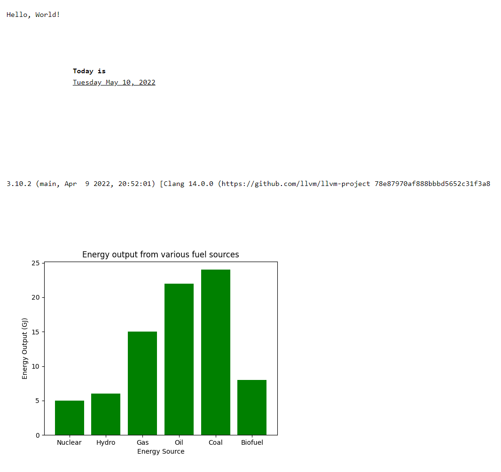

# Notes

- http://localhost/python-web/ (index.php)
- https://github.com/pyscript/pyscript/blob/main/GETTING-STARTED.md (Getting started with PyScript)
- https://pyscript.net/ (Run Python in Your HTML)
- https://github.com/pyscript/pyscript/tree/main/pyscriptjs/examples (Examples)

### Addons

- https://benalexkeen.com/bar-charts-in-matplotlib/ (Bar Charts in Matplotlib)

